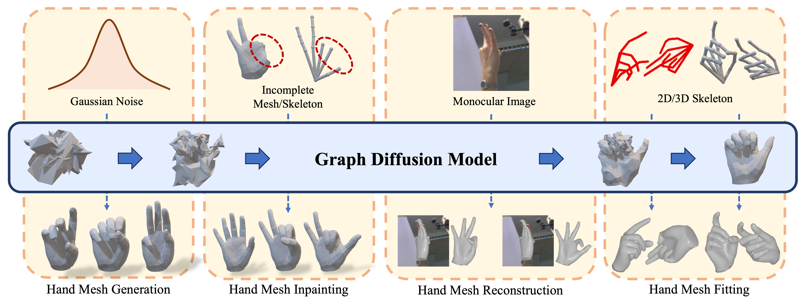

Hi, this is Mengcheng Li. I am a Ph.D. student in the Department of Automation at Tsinghua University, advised by Prof. [Yebin Liu](http://www.liuyebin.com/). My research focuses on hand motion capture, hand 3D reconstruction, hand interaction and motion generation, and hand avatar generation.

## Education

- Bachelor’s Degree in physics, **Tsinghua University** *(2014-2018)*
- Ph.D student in automation, **Tsinghua University** *(2018-now)*

## Research

<table style="width:100%;border:none;border-spacing:0px;border-collapse:separate;margin-right:auto;margin-left:auto;font-size: large">
<tr>
<td style="padding:20px;width:30%;vertical-align:middle;border:none" align="center">

</td>
<td style="padding:20px;width:70%;vertical-align:middle;border: none" align="left">
<b>HHMR: Holistic Hand Mesh Recovery by Enhancing the Multimodal Controllability of Graph Diffusion Models</b> 
<b>Mengcheng Li</b>, Hongwen Zhang, Yuxiang Zhang, Ruizhi Shao, Tao Yu, Yebin Liu. 
<i>IEEE Conference on Computer Vision and Pattern Recognition (<b>CVPR</b>), 2024 <b>☆ HighLight Paper</b></i> 
<a href="/project/HHMR/HHMR.html"><i class="fas fa-fw fa-globe"></i>Projectpage</a> /
<a href="/project/HHMR/assets/main.pdf"><i class="fas fa-fw fa-file-pdf"></i>Paper</a> /
<!-- <a><i class="fab fa-fw fa-github fa-github"></i>Code (Coming Soon)</a> -->
</td>
</tr>
</table>

---

<table style="width:100%;border:none;border-spacing:0px;border-collapse:separate;margin-right:auto;margin-left:auto;font-size: large">
<tr>
<td style="padding:20px;width:30%;vertical-align:middle;border:none" align="center">

</td>
<td style="padding:20px;width:70%;vertical-align:middle;border: none" align="left">
<b>Interacting Attention Graph for Single Image Two-Hand Reconstruction</b> 
<b>Mengcheng Li</b>, Liang An, Hongwen Zhang, Lianpeng Wu, Feng Chen, Tao Yu, Yebin Liu. 
<i>IEEE Conference on Computer Vision and Pattern Recognition (<b>CVPR</b>), 2022 <b>☆ Oral Paper</b></i> 
<a href="/project/IntagHand/Intaghand.html"><i class="fas fa-fw fa-globe"></i>Projectpage</a> /
<a href="https://arxiv.org/abs/2203.09364.pdf"><i class="fas fa-fw fa-file-pdf"></i>Paper</a> /
<a href="https://github.com/Dw1010/IntagHand"><i class="fab fa-fw fa-github fa-github"></i>Code</a>
</td>
</tr>
</table>

---

<table style="width:100%;border:none;border-spacing:0px;border-collapse:separate;margin-right:auto;margin-left:auto;font-size: large">
<tr>
<td style="padding:20px;width:30%;vertical-align:middle;border:none" align="center">

</td>
<td style="padding:20px;width:70%;vertical-align:middle;border: none" align="left">
<b>PyMAF-X: Towards Well-aligned Full-body Model Regression from Monocular Images</b> 
Hongwen Zhang, Yating Tian, Yuxiang Zhang, <b>Mengcheng Li</b>, Liang An, Zhenan Sun, Yebin Liu. 
<i>IEEE Transactions on Pattern Analysis and Machine Intelligence (<b>TPAMI</b>), 2023</i> 
<a href="https://www.liuyebin.com/pymaf-x/"><i class="fas fa-fw fa-globe"></i>Projectpage</a> /
<a href="https://arxiv.org/pdf/2207.06400.pdf"><i class="fas fa-fw fa-file-pdf"></i>Paper</a> /
<a href="https://github.com/HongwenZhang/PyMAF-X"><i class="fab fa-fw fa-github fa-github"></i>Code</a>
</td>
</tr>
</table>

---

<table style="width:100%;border:none;border-spacing:0px;border-collapse:separate;margin-right:auto;margin-left:auto;font-size: large">
<tr>
<td style="padding:20px;width:30%;vertical-align:middle;border:none" align="center">

</td>
<td style="padding:20px;width:70%;vertical-align:middle;border: none" align="left">
<b>Light-weight Multi-person Total Capture Using Sparse Multi-view Cameras</b> 
Yuxiang Zhang，Zhe Li，Tao Yu, <b>Mengcheng Li</b>, Liang An, Yebin Liu. 
<i>IEEE Conference on International Conference on Computer Vision (<b>ICCV</b>), 2021</i> 
<a href="https://www.liuyebin.com/lwtotalcap/lwtotalcap.html"><i class="fas fa-fw fa-globe"></i>Projectpage</a> /
<a href="https://www.liuyebin.com/lwtotalcap/assets/main.pdf"><i class="fas fa-fw fa-file-pdf"></i>Paper</a>
</td>
</tr>
</table>

---

<table style="width:100%;border:none;border-spacing:0px;border-collapse:separate;margin-right:auto;margin-left:auto;font-size: large">
<tr>
<td style="padding:20px;width:30%;vertical-align:middle;border:none" align="center">

</td>
<td style="padding:20px;width:70%;vertical-align:middle;border: none" align="left">
<b>Learning Explicit Contact for Implicit Reconstruction of Hand-held Objects from Monocular Images</b> 
Junxing Hu, Hongwen Zhang, Zerui Chen, <b>Mengcheng Li</b>, Yunlong Wang, Yebin Liu, Zhenan Sun. 
<i>AAAI Conference on Artificial Intelligence (<b>AAAI</b>), 2024</i> 
<a href="https://junxinghu.github.io/projects/hoi.html"><i class="fas fa-fw fa-globe"></i>Projectpage</a> /
<a href="https://ojs.aaai.org/index.php/AAAI/article/view/27995"><i class="fas fa-fw fa-file-pdf"></i>Paper</a> /
<a href="https://github.com/JunxingHu/CHOI"><i class="fab fa-fw fa-github fa-github"></i>Code</a>
</td>
</tr>
</table>

---
